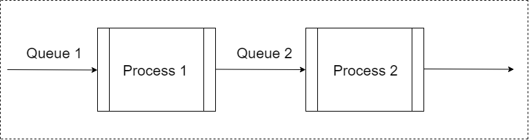

# Tutorial multiprocessing python

The goal of this article is to present shortly a solution for the following problem.


## The full problem

Let's imagine we have a flow of files getting in the system from the the web.
We need to process each file with **Process1** and then with **Process2**.
Of course we don't want to wait for all the files to be processed by **Process1** and then by **Process2**.
So we need a way to make a pipeline so that the flow is continuous.

## The "simple" Solution

### Processes and Queues

Here we will use, the multiprocessing package of python 3.6. [for more details](https://docs.python.org/3.6/library/multiprocessing.html#module-multiprocessing)
This package allows to run several instances of python.exe, each python.exe is responsible for a specific task.
In order to create a flow between them we use a Queue (LILO).
Basically, the first in the queue will be th efirst to go out to the next process.




### The code

#### Entry point (WEB)

Let's moke the data coming in with a simple function. This function adds in the first queue numbers one by one. 
```python
ENTRY_ARRAY = range(0, 5000)

def process_init(queueIn):
    for val in ENTRY_ARRAY:
        print("entering the Q : ", val)
        queueIn.put(val)
```

#### First process

As an example, the **Process1** will square the incoming numbers from the Queue1 and throw them out to the Queue2.

```python

def f1(value):
    return value ** 2

def process1(queueIn, queueOut):
    while True:
        try:
            tmp = queueIn.get()
            print("tmp process1 : ", tmp)
            queueOut.put(f1(tmp))
        except Exception as e:
            print("Exception 1 : ", e)
            break

```

#### Second process

As an example, the **Process2** will operate the sqrt on the incoming numbers from the Queue2/Process1 and throw them out (to the Queue3 if we want).


```python
def f2(value):
    return math.sqrt(value)

def process2(queueIn):
    while True:
        try:
            tmp = queueIn.get()
            print("tmp process2 : ", f2(tmp))
            #queueOut.put(f2(tmp))
        except Exception as e:
            print("Exception 2 : ", e)
            break
```


#### The multiprocessing part

First we instantiate the queues:
```python
queue1 = multiprocessing.Queue()
queue2 = multiprocessing.Queue()
```
Then we instantiate the Processes:
```python
# The worket init is just the process to fill the queue1 with numbers
worker_init = multiprocessing.Process(target=process_init, args=(queue1,))

worker1 = multiprocessing.Process(target=process1, args=(queue1, queue2))
worker2 = multiprocessing.Process(target=process2, args=(queue2,))

# Start the proceses
worker_init.start()
worker1.start()
worker2.start()
```

#### The full code to sum up

```python
import multiprocessing
import math
import sys

ENTRY_ARRAY = range(0, 5000)


def f1(value):
    return value ** 2


def f2(value):
    return math.sqrt(value)

def process_init(queueIn):
    for val in ENTRY_ARRAY:
        print("entering the Q : ", val)
        queueIn.put(val)


def process1(queueIn, queueOut):
    while True:
        try:
            tmp = queueIn.get()
            print("tmp process1 : ", tmp)
            queueOut.put(f1(tmp))
        except Exception as e:
            print("Exception 1 : ", e)
            break


def process2(queueIn):
    while True:
        try:
            tmp = queueIn.get()
            print("tmp process2 : ", f2(tmp))
        except Exception as e:
            print("Exception 2 : ", e)
            break


def main():

    queue1 = multiprocessing.Queue()
    queue2 = multiprocessing.Queue()


    worker_init = multiprocessing.Process(target=process_init, args=(queue1,))
    worker1 = multiprocessing.Process(target=process1, args=(queue1, queue2))
    worker2 = multiprocessing.Process(target=process2, args=(queue2,))

    worker_init.start()
    worker1.start()
    worker2.start()


if __name__ == '__main__':
    sys.stdout = open(r'C:\Users\noambl\Desktop\flow.txt', 'w')
    main()

```


